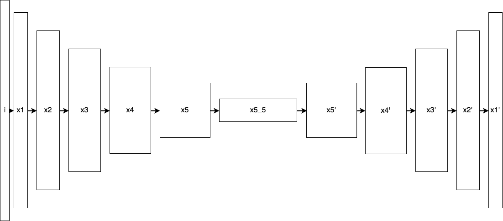
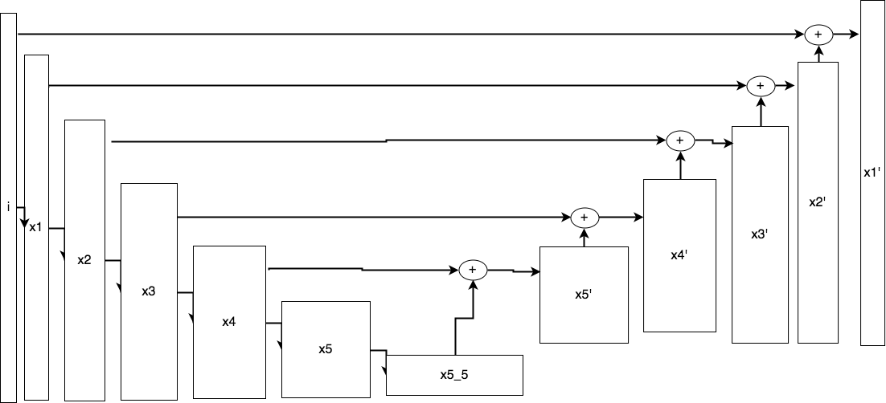
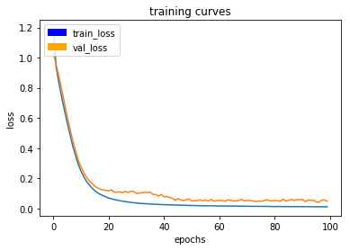

# Project Report

## Writeup

### Provide a write-up / README document including all rubric items addressed in a clear and concise manner. The document can be submitted either in either Markdown or a PDF format

You are reading the write-up.

### The write-up conveys the an understanding of the network architecture

I followed the suggestions in the lectures and the project descriptions, and built a Fully Convolutional Network (FCN) to achieve the segmentation needed for the project.

The main building blocks of an FCN are the following:
- Convolutional Neural Network (CNN)
- 1x1 Convolution
- Transposed convolutional layers for upsampling
- Skip connections

These building blocks make up a very good model for image segmentation. The first three building blocks can be seen in this image:

While the skip connections blend in the CNN layers to improve the image segmentation. This layout can be seen in this image:

I ended up using a fairly deep FCN in my project, consisting of 5 layers CNNs and the same number of upsampling layers with skip connections.

I addition to the suggestions in the lessons, I also included an extra convolution layer in the encoder, to allow the network to learn even more features.

### The write-up conveys the student's understanding of the parameters chosen for the the neural network

#### Learning rate
I tried different learning rates, but they either overtrained, or trained very, very slow. In the end the recommended learning rate for nadam optimiser ended up being my choice as well:
0.002

#### Batch size
In short this number should be as high as your system can handle. In my case, my GPU could handle a batch size of 40.

#### Steps per epoch
A good number here should be the number of images to train on, divided by the batch size. Which is why I chose the number 94.

#### Validation steps per epoch
Same as with steps per epoch, only related to number of images to validate on. My number was 30.

#### Number of epochs
This is the number of times you want the training to run. The balance it between not training enough and overtraining. The right balance gives us the best performing model, in it's most general form. With the size of my model and the learning rate, I ended up running the training for 100 epochs.

#### Result
The result of these hyper parameters gave the learning loss are shown in the figure below. As the figure shows the loss jumps up and down a bit, and even indicates overlearning. Part of this was because I only used the provided validation data, and part of it falls down on the Nadam optimizer.

#### Workers
This is the number of parallel processes during training. I tried different values here, but could not find any significant differences. I ended up with 4.

### The student has a clear understanding and is able to identify the use of various techniques and concepts in network layers indicated by the write-up

See explanation above.

In addition to the provided to code I ended up switching optimizer to Nadam. It turned out to tune my model a bit better than Adam.

### The student has a clear understanding of image manipulation in the context of the project indicated by the write-up

I followed the suggetions from the classroom lessons, and collected data in 3 different ways:
1: Follow hero while zig-zagging and other people around
2: Patrol large path without hero or other people
3: Images of hero at distance with lots of people. I got inspired of the last video showing lots of rounds around a bush.

In addition I created the file called filter.py, which deletes all the images in a folder not containing the hero. I ran the filter on number 1 and 3 in the list above, to help ficus the training.
To capture enough images for step 3 I set up a path for hero and drone, and let it run at full speed for 45 minutes. This gave me about 11000 images, which I in turned ran the filter on, and ended up with about 3000 images of the hero at various angles and distances, in crowded area.

### The student displays a solid understanding of the limitations to the neural network with the given data chosen for various follow-me scenarios which are conveyed in the write-up

The project description indicates that more image capturing might be needed to get the mandatory result. This became clear as I tested the model in the simulator. In the patrol mode, the model had problems locating the hero. But once the model changed to follow mode, it behaved very good. This indicate to me that the images provided lacks in detecting the hero at distance and from different angles, but also that the images as a good sample of the hero from behind.

As a next step I started to collect large amounts of images to try to improve this area. I captured about 3000 more images of the hero.

## Model
### The model is submitted in the correct format
The resulting model can be found in the folder called data/weights . The model uses the default name of 'model_weights'.

### The neural network must achieve a minimum level of accuracy for the network implemented

To perform at the required bar, I ended up with a large model, which I in addition trained on images of full size. As a result the inception part could no longer run on my laptop, but needed the support of a proper GPU to run. Put overall performance is now good.

The resulting IoU (Intersection of union) score is 54%. Over the required threshold.

A video from the follow mode can be found [here (docs/misc/FollowMe.mp4)](./docs/misc/FollowMe.mp4)

## Improvements
### Descrease the size of the model
As indicated above, The model now requires GPU to run properly. The model could possibly be tuned to perform at the same level, but smaller. I am not sure, but I believe with more time, it should be possible.

### Tensorflow
I own a multi GPU computer, so a rewrite to Tensorflow to make use of both the GPUs in my computer, would most likely improve the speed of trsining. Which in turn would allow me to test many more models and hyperparameters. Since Keras can use Tensorflow as it's backend, such a rewrite should be very possible.

## Summary
The whole process was very time consuming. I have had my computer running every night for almost a week not to test different approaches. At the end I went for lots of data, a very big model, and a different optimizer. Which in sum brought me over the threshold.
