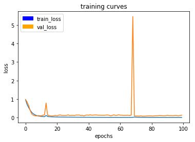

# Project Report

## Writeup

### Provide a write-up / README document including all rubric items addressed in a clear and concise manner. The document can be submitted either in either Markdown or a PDF format

You are reading the write-up.

### The write-up conveys the an understanding of the network architecture

I followed the suggestions in the lectures and the project descriptions, and built a Fully Convolutional Network (FCN) to achieve the segmentation needed for the project.

The main building blocks of an FCN are the following:
- Convolutional Neural Network (CNN)
- 1x1 Convolution
- Transposed convolutional layers for upsampling
- Skip connections

These building blocks make up a very good model for image segmentation. The first three building blocks can be seen in this image:

While the skip connections blend in the CNN layers to improve the image segmentation. This layout can be seen in this image:

I ended up using a fairly deep FCN in my project, consisting of 5 layers CNNs and the same number of upsampling layers with skip connections.

### The write-up conveys the student's understanding of the parameters chosen for the the neural network

#### Learning rate
I tried different learning rates, but they either overtrained, or trained very, very slow. In the end the recommended learning rate for adam optimiser ended up being my choice as well:
0.001

#### Batch size
In short this number should be as high as your system can handle. In my case, my GPU could handle a batch size of 256.

#### Steps per epoch
A good number here should be the number of images to train on, divided by the batch size. Which is why I chose the number 15.

#### Validation steps per epoch
Same as with steps per epoch, only related to number of images to validate on. My number was 5.

#### Number of epochs
This is the number of times you want the training to run. The balance it between not training enough and overtraining. The right balance gives us the best performing model, in it's most general form. With the size of my model and the learning rate, I ended up running the training for 100 epochs.

#### Result
The result of these hyper parameters gave the learning loss are shown in the figure below.

#### Workers
This is the number of parallel processes during training. I tried different values here, but could not find any significant differences. I ended up with 10.

### The student has a clear understanding and is able to identify the use of various techniques and concepts in network layers indicated by the write-up

See explanation above.

### The student has a clear understanding of image manipulation in the context of the project indicated by the write-up

See explanation above.

### The student displays a solid understanding of the limitations to the neural network with the given data chosen for various follow-me scenarios which are conveyed in the write-up

The project description indicates that more image capturing might be needed to get the mandatory result. This became clear as I tested the model in the simulator. In the patrol mode, the model had problems locating the hero. But once the model changed to follow mode, it behaved very good. This indicate to me that the images provided lacks in detecting the hero at distance and from different angles, but also that the images as a good sample of the hero from behind.

## Model
### The model is submitted in the correct format
The resulting model can be found in the folder called data/weights . The model uses the default name of 'model_weights'.

### The neural network must achieve a minimum level of accuracy for the network implemented

The model performs OK in follow mode, but takes a long time to lock on to the hero. This means that the model does not recognise the hero from many different distances and angles. But as soon as the model locks on, the follow mode is solid.

The resulting IoU (Intersection of union) score is 46%. Over the required threshold, but not by much. The detection of the hero at distance ruins the score and performance.

A video from the follow mode can be found [here (docs/misc/FollowMe.mp4)](./docs/misc/FollowMe.mp4)

## Improvements
### Capture more pictures
As indicated above, I believe the model would behave much better on a set of captured images of the hero. Both at distance and at different angles.

### Train on more images
With more captured data the model could be trained to behave better at distance.

### Train two networks
It might also be beneficial to train two different models. One for following the hero, and a different one for locating the hero. This would allow for the network to be more specialized.

### Train two different last half
As indicated in the lessons it is possible to construct a model where the CNN part, and the 1x1 convolution is identical for the two network. But the transpose, upsampling and skip connections are specialized for different purposes. This relates to the suggestion above about separate models, but could be a much more effective way to achieve the same result: Specialised models (or part of a model).

### Tensorflow
I own a multi GPU computer, so a rewrite to Tensorflow to make use of both the GPUs in my computer, would most likely improve the speed of trsining. Which in turn would allow me to test many more models and hyperparameters. Since Keras can use Tensorflow as it's backend, such a rewrite should be very possible.
